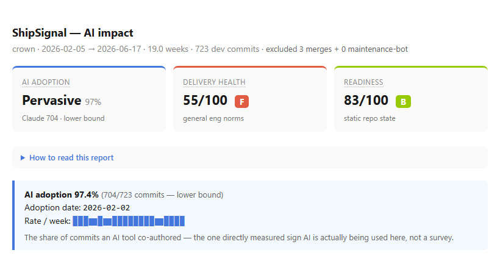

# ShipSignal — the AI impact & delivery-health scanner

[](https://pypi.org/project/shipsignal/) [](https://pypi.org/project/shipsignal/) [](https://github.com/jpaul67/ShipSignal/actions/workflows/live-badge.yml) [](LICENSE)



> **Is AI actually changing how your team ships — and can you prove it without overclaiming?**
> One read-only, local command points at any repo and tells you three things: how much AI is *actually* being used (measured from commit trailers, not guessed), whether delivery health is sound (graded against general engineering norms, never falsely credited to AI), and whether the repo is set up for agents to succeed — with the specific fixes. The only scanner honest enough to withhold a number it can't back up.

Pure Python stdlib, no runtime deps, runs on any repo in seconds. Read-only and local — nothing leaves your box.

## Install

```bash
uvx shipsignal report <repo>   # zero-install, via uv
# or
pip install shipsignal
```

Requires Python 3.11+. No runtime dependencies.

## Quick start

```bash
# Unified audit — all three numbers + fixes, one deliverable (recommended)
shipsignal report ../crown --html crown-audit.html

# Or run a single lens
shipsignal impact ../crown          # impact + delivery health
shipsignal scan ../crown            # readiness only
shipsignal scan . --fail-under 80   # CI gate
```

See [examples/crown-audit.html](examples/crown-audit.html) for a real audit deliverable. From a source checkout, the same commands run as `python -m shipsignal.cli …`.

## Impact lens — three always-on numbers

Every impact scan headlines with three numbers that are *always* computed (above a tiny sample floor):

| Number | What it is |
|---|---|
| **AI Adoption** | `Co-Authored-By:` trailer share + level (None / Emerging / Established / Pervasive). The one direct, AI-specific signal — a lower bound: GitHub-native squash preserves co-authors, but some pipelines (internal-sync bots, some merge queues) strip them, and `--pr-data` recovers those (below). |
| **Delivery Health** | A 0–100 snapshot scored against general engineering norms — *not* AI-attributed. Combines change-size discipline, test discipline, and (for teams) knowledge distribution. Flags surface real risks (`low test discipline`, `concentration risk`). |
| **Readiness** | The static-state score (the readiness lens, below). Runs by default; `--no-readiness` to skip. |

A fourth, *conditional* **Before/after AI Enablement** delta appears only when the data supports it — a clean pre-AI baseline window AND ≥ 20 commits in both windows AND ≥ 50 commits total AND ≥ 6 weeks of history. In the wild that combination is rare (most repos are AI-from-inception, no-AI, or ambient-AI), so it's the *bonus*, not the headline — competitors fake this score; we don't.

An **Outcomes** block rides along as pure context, never scored: revert-pair count + median time-to-correction, computed from git's own `git revert` format (subject `Revert "..."` + body `This reverts commit <sha>`) plus explicit `Fixes:`/`Reverts:` trailers, matched by sha against the analyzed history — a revert-of-a-revert is just another pair, and unmatched reverts (target outside the window) are disclosed, not hidden. Reports `n/a` below 3 matched pairs. It's commit-scoped, not MTTR — production incidents aren't in git. Alongside it, the change-failure proxy (the fix/revert subject rate) is relabeled honestly: it measures commit-labeling discipline as much as failure rate, so it's forbidden from ever feeding Delivery Health.

A **Release cadence & lead time** block reads the same honesty rules from version tags: tags-per-month + median inter-tag gap (trailing 12 months, falling back to the full tag history when sparse), and lead time (median days from a commit landing to the release tag that shipped it) over every consecutive tag pair — one `git log` call per pair, never per commit. Tags are filtered to release-shaped ones (default `v?N.N[.N]`, overridable per repo via `.shipsignal.toml`'s `release_tag_pattern` for monorepo tags like `pkg@1.2.3`). Reports `n/a` below 3 matched tags — **tags aren't deploys** (a service can deploy without tagging), so an untagged repo is never penalized. With Outcomes and Release cadence both landed, that's the DORA-shaped picture from git history alone, zero integrations: deploy frequency ✓, lead time ✓, change-failure proxy ✓ (context) — time-to-restore ✗, because production incidents simply aren't in git, and saying so honestly beats guessing.

An opt-in **AI line-survival** block (`--survival`) asks a durability question the adoption number can't: of the lines AI-authored commits added, how many still survive in today's code, versus non-AI lines **of the same age**? It's metadata-only (`git blame --incremental` — never reads source content), age-matched (a month counts only with both an AI and a non-AI commit ≥90 days old, so younger AI lines aren't flattered), a lower bound (a big refactor that moves code reads as death), and **never scored**. Honest by construction, it reports a rate *only* at full blame coverage — withholding (never sampling) on repos over the file cap, on recent adopters whose commits haven't aged 90 days, and below the matched-month floors — and hints at `--adoption-date` when auto-detection places the adoption window too recently. A *narrow* signal in practice (most repos withhold), but real where it applies.

A **squash-attribution recovery** path (`--pr-data`) closes the one honest gap in the adoption number, with **zero network calls**. Most squash merges are fine — GitHub-native "Squash and merge" aggregates co-authors onto the squash commit, so the local scan already sees them. But pipelines that bypass that aggregation (internal-monorepo sync bots, some merge queues, manual local squashes) drop the trailers and undercount AI. You export merged-PR data with one `gh` command; ShipSignal reads the local file:

```bash
gh pr list --state merged --limit 25 --json number,mergeCommit,mergedAt,commits > pr.json
shipsignal impact <repo> --pr-data pr.json
```

It matches each squash commit back to its PR by merge-commit SHA (or the `(#NNN)` subject), re-runs the PR's co-authors through the same AI registry, and shows a **dual figure** — `measured None 0% → recovered Emerging 0.2% · coverage 88%` — never silently replacing the measured number, and disclosing match coverage so a stale export reads as low coverage, not false confidence. ([A real run on jest](examples/jest-recovery.md) — whose Meta-sync pipeline strips trailers — recovers **9 hidden AI commits** across Claude / Cursor / Copilot / Cody that a local scan reports as 0%.) On big repos `--limit 1000` in one call trips GitHub's GraphQL node ceiling — export in chunks of ~25. When a squash workflow is detected and you *haven't* supplied `--pr-data`, the report prints this recipe itself.

Calibrated across crown (Pervasive · 55/F · 83/B — flags a real test gap), chalk (None · 77/C · 80/B — flags maintainer concentration), vitest (Emerging · 97/A · 97/A — clean). Every delivery number carries an attribution caveat: it measures general delivery health, never *proves* AI caused a change.

## Readiness lens — is the repo set up for agents?

| Detector | What |
|---|---|
| Entry point | Root README present and substantial |
| Agent instructions | `CLAUDE.md` / `AGENTS.md` / `.cursor/rules` / copilot-instructions (size-scaled) |
| Module README coverage | Each detected module is documented |
| Setup & conventions | test command, CI, deps/lockfile, lint/format/type config, `.editorconfig`, LICENSE, CONTRIBUTING, MCP path-resolution |
| Broken links | Markdown links resolve (with false-positive guards) |
| Doc freshness | Module docs haven't drifted behind their code |

Module detection is **ecosystem-aware** (npm / pnpm / Cargo workspaces, then a directory fallback), respects `.gitignore`, and excludes vendored/build dirs. Six scored categories sum to 100 (entry 20, agent 15, coverage 20, setup 20, integrity 13, freshness 12). Categories can be **n/a** or **indeterminate**; the score renormalizes over what was actually scored, so a small well-documented library isn't punished.

## Output

A canonical JSON (`readiness.json` / `impact.json` / combined `report` JSON — findings or metrics, **never file or diff contents**), CLI text (colored on a real terminal; `--no-color` or `NO_COLOR` to disable), optional Markdown / HTML reports, and a `readiness: N/100` badge SVG. Exit non-zero with `--fail-under N` for CI gates — or drop in the [GitHub Action](#use-it-in-ci-github-action).

The SVG badge is static — it goes stale the moment the score changes. `--badge-json FILE` (on `scan` and `report`) writes a [shields.io endpoint payload](https://shields.io/badges/endpoint-badge) instead: publish it somewhere shields can fetch it (a gist, GitHub Pages, ...) and the badge in your README updates on its own, no re-commit needed. See [examples/workflows/live-badge.yml](examples/workflows/live-badge.yml) for a full recipe (publish to a gist from CI):

```bash
shipsignal scan . --badge-json badge.json
gh gist edit <gist-id> badge.json   # or `gh gist create` the first time
# README: 
```

Readiness fixes are **ranked by payoff** — each carries an `≈+N pts` estimate (computed by re-scoring as if it were resolved, so the number always matches the model), an effort tag (`quick` / `moderate`), and a `file:line` location where one applies. Desync flags that don't move the score are labelled `informational` rather than padded with a number.

Add `--snapshot` to any command to persist a small (<8KB) JSON record under `.shipsignal/snapshots/YYYY-MM-DD-<sha>.json`. Gitignored by default; remove the `.shipsignal/` line from `.gitignore` to commit your audit history. Then:

```bash
shipsignal trend . --html trend.html   # readiness/breadth/AI deltas + SVG line chart
shipsignal trend . --limit 8 --since 2026-01-01
```

The trend view reads only existing snapshots — no re-scan, fully offline. Honest about single-snapshot ("scan again to start a trend"), schema-version mismatches (skips the fixes diff rather than inventing false resolutions), and large window jumps (warns when one snapshot covers >30% more commits than its predecessor).

## Configuration

Drop a `.shipsignal.toml` in the repo root for team-wide defaults — picked up automatically by every command, including in CI:

```toml
[impact]
extra_ai_aliases = { "acmebot" = "Acme internal" }  # merged into the AI-tool registry
squash = true                                       # declare a squash-merge workflow
release_tag_pattern = "^pkg@\\d+\\.\\d+\\.\\d+$"      # override the default v?N.N[.N] tag filter

[readiness]
fail_under = 80
exclude_modules = ["vendor/legacy"]                 # waive from the module-README requirement

[report]
badge_label = "readiness"
```

Precedence is **CLI flag > config file > built-in default** — e.g. `--fail-under` on the command line always wins over `fail_under` in the config. All keys are optional; an unknown key or a wrong-typed value degrades to a printed warning and the built-in default, never a crash. `extra_ai_aliases` keys must be a single word (matching is exact-token, same as the built-in registry) — a hyphenated or multi-word key can't match anything and is rejected with a warning.

## Use it in CI (GitHub Action)

Gate the readiness score on every push and PR, and get the report in the run summary:

```yaml
# .github/workflows/shipsignal.yml
name: readiness
on: [push, pull_request]
jobs:
  shipsignal:
    runs-on: ubuntu-latest
    steps:
      - uses: actions/checkout@v4
      - uses: jpaul67/ShipSignal@v1
        with:
          fail-under: "80"   # omit to report without failing the build
```

Add `pr-comment: "true"` (and `permissions: pull-requests: write`) to get a sticky PR comment —
score, grade, top 3 fixes — that updates in place on every push instead of a summary tab nobody
opens. See [examples/workflows/pr-comment.yml](examples/workflows/pr-comment.yml).

Full inputs/outputs and more examples: [docs/github-action.md](docs/github-action.md).

## Project layout

- [shipsignal/](shipsignal/README.md) — the package (module map inside)
- `tests/` — stdlib `unittest` suite
- [examples/](examples/) — a committed sample audit + a copy-paste CI workflow
- Working with an agent? See [CLAUDE.md](CLAUDE.md) / [AGENTS.md](AGENTS.md).

## License

MIT (see [pyproject.toml](pyproject.toml)).
